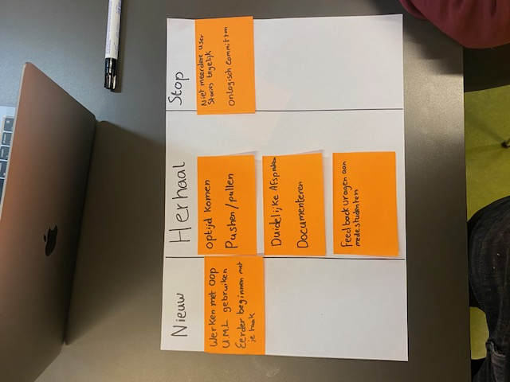

# Retrospective dagje met groepje 

## Stop:

- Niet aan meerdere user stories tegelijk werken 
 
Dit zorgt voor een onoverzichtelijke werksfeer, het is beter om aan 1 te werken totdat die af is.

- Onlogisch committen 
 
Het is wel is voorkomen dat ik een onduidelijke naam heb gegeven aan een commit. 

## Herhaal

- Optijd komen
 
Tot nu toe komen ik en Roan optijd

- Veel pushen & pullen 
 
Aangezien we nu in duo's werken is het beter om je werk up to date te houden zodat je duo ook goed kan zien waar je mee bezig bent

- Duidelijke afspraken maken
 
Voordat we aan ons werk beginnen maken we afspraken wie wat doet, dit verloopt tot nu toe goed

- Documenteren
 
De testen die we hebben uitgevoerd hebben we netjes gedocumenteerd, volgende sprint gaan we ook ons werk/code documenteren

- Feedback vragen aan medestudenten
 
Aangezien ons doelgroep ook de medestudenten zijn kunnen we hele nuttige informatie uit hun halen

## Nieuw

- Werken met OOP
 
In de online lessen werd vermeld wat OOP was en dat we het moesten gebruiken

- UML Gebruiken
 
Zelfde als OOP word dit in de nieuwe sprints van ons verwacht

- Eerder beginnen met je taak
 
Ik ben er aan gewend om laat in de avond nog steeds aan school te werken maar die tijden gaan niet overeen met mijn duo, dus is het handiger om gewoon eerder er aan te beginnen en dus niet om 22;00

### Medestudenten: Erdem, Roan & Sabri 1 December 2023

(G1)

(G8)