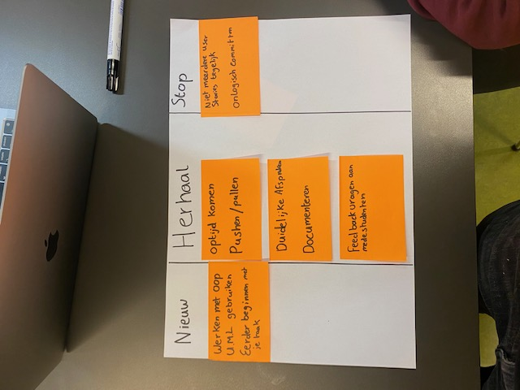

# retro spective 1

### -nieuw

-   Werken met OOP: Moeten gaan beginnen met OOP programmeren.

-    We moeten ook gaan beginnen met UML 

### - Herhaal

-   Vaak code comitten: Ik commit me code vaak als ik een verandering maak aan me pagina.

-   vragen stellen: Ik stel veel vragen, en zal daar verder mee gaan zodat ik meer leer.

-   Op tijd komen: Moet zoals gewoonlijk optijd komen zodat ik geen belangrijke informatie mis.

-   meer pullen.

### - Stop

-   Niet aan meerdere issues tegelijk werken: Hierdoor wordt het lastig om op 1 ding te focussen en komt er vertraging.

-   Niet meer dan 1 taal gebruiken: Dit deed ik even aan het begin, maar ik heb mezelf hier snel op gecorriceerd dat ik alleen nederlands gebruik.

# Retrospective dagje met Erdem
 
## Stop:
 
- Vast lopen op 1 probleem
 
ik heb lang stil gestaan bij een query probleem
 
- Aan een nieuwe issue werken en niet documenteren

 
- onlogisch committen
 
Soms maak ik een commit met als naam ''small''
 
 
## Herhaal
 
- Optijd komen
 
Tot nu toe komen ik en Roan optijd
 
- Veel committen
 
ik commit regelmatig
 
- Duidelijk documenteren
 
tot nu toe veel complimenten gekregen over mijn documentatie
 
- Duidelijke communicatie
 
we hebben veel contact met elkaar en het verloopt altijd respectvol
 
- Feedback geven
 
we geven veel feedback aan elkaar
 
## Nieuw
 
- Werken met OOP en UML gebruiken
 
Donderdag is er OOP voorbeeld in het project, dan gaan we aan die van ons werken
 
- Dagelijks updates aan elkaar geven
 
soms hebben we niet contact met elkaar voor een paar dagen, dit kan beter
 
 
 
 
 
 
### Medestudenten: Erdem, Roan 9 Januari 2024